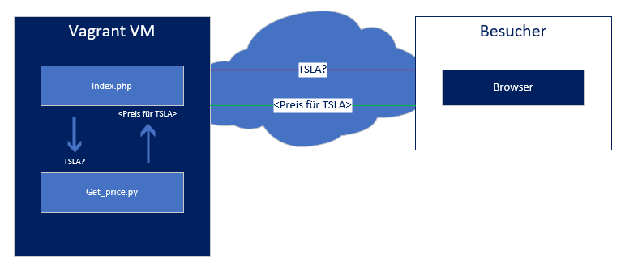

# Table of contents

- [Table of contents](#table-of-contents)
- [1. Einleitung](#1-einleitung)
- [2. Webseite](#2-webseite)
  - [2.1 Konzept](#21-konzept)
  - [2.2 Funktionsweise der Webseite](#22-funktionsweise-der-webseite)
  - [2.3 Funktionsweise "get_price.py"](#23-funktionsweise-get_pricepy)
- [3. Sicherheit](#3-sicherheit)
  - [3.1 Funktionsweise von htaccess](#31-funktionsweise-von-htaccess)
  - [3.2 Aufbau von htaccess](#32-aufbau-von-htaccess)

    
# 1. Einleitung

In der LB2 werden wir eine Webseite erstellen, welche anhand eines Aktien kürzels den Preis der aktie rausfinden kann.
Ziel ist die Website selbst zu erstellen, Sie automatisch auf der Vagrant vm laufen zu lassen und die Seite Passwort zu schützen. 
    

# 2. Webseite

 

___
## 2.1 Konzept
___

 

Die Website soll eine PHP-Webseite sein, welche eine Python Datei zum rausfinden von Aktien preisen benutzt. 

Hier visualisiert:
 
*Der Zugriff übers Internet funktioniert leider nicht*
 
 

___
## 2.2 Funktionsweise der Webseite
___

 

Auf der Webseite haben wir ein kleines Fenster zum Eingeben des Valors erstellt welches mit einem Submit button abgeschickt werden kann.

    <form action="" method="Post">
        <label for="stock">Stock:</label> 
        <input type="text" id="stockin" name="stock" value="" > 
        <input type="submit" id="stocksub" name="submit" value="Submit">
    </form>

Um die Daten auszulesen wird anschliessend PHP verwendet, was in der Praxis etwa so aussieht:

    <?php
        $valor = $_POST['stock'];
        $price = exec("python3.6 ./python/get_price.py $valor 2<&1");
        $valor_py = file_get_contents( "./python/tmp/stock" );
        $price_py = file_get_contents( "./python/tmp/price" );
        echo $valor_py;
        echo $price_py;
    ?>

Dabei ist $valor der eingegebene Wert, welcher weiter unten verwendet wird um mithilfe von Pyhton den Preis rauszufinden. An unterster Stelle werden sowohl der Preis als auch der Valor ausgegeben welche aus den von Python erstellten Files ausgelesen werden kann. 

 

___ 
## 2.3 Funktionsweise "get_price.py" 
___

 

Die "get_price.py" datei ist eine Python Datei, welche den Preis des Valors mithilfe einer API rausfindet. Anschliessend wird sowohl der Valor als auch der Preis in zwei seperate Files geschrieben. Diese werden dann wie oben vom PHP auf der Webseite angezeigt. 

Hier eine kleine übersicht zu den Dateien:

| Filename | Description        | Path                      | Content  |
|----------|--------------------|---------------------------|----------|
| stock    | Name of the stock  | /website/python/tmp/stock | ``tsla``     |
| price    | Price of the stock | /website/python/tmp/price | ``658.(..)`` |

 
Die Python Datei sieht folgendermassen aus:

 

    #1 import sys
    #2 from yahoo_fin import stock_info as si
    #3
    #4 stock = str(sys.argv[1])
    #5
    #6 price = si.get_live_price(stock)
    #7 price_str = str(price)
    #8 file_price = "/var/www/html/python/tmp/price"
    #9 file_stock = "/var/www/html/python/tmp/stock"
    #10
    #11 with open(file_price, 'w') as fileowrite:
    #12        fileowrite.write(price_str+" ")
    #13
    #14 with open(file_stock, 'w') as fileowrite:
    #15        fileowrite.write(stock+" ")

-   Im oberen Teil werden alle benötigten Module installiert welche benötigt werden. "sys" benutze ich im script, um Argumente vom PHP entgegen zu nehmen (#4). 
-   Das zweite Modul in der Zeile #2 wird dazu benötigt die aktuellen Preise der Aktien zu bekommen. 
-   Anschliessend wird in der Zeile #6 der preis rausgefunden in dem Man die API mit dem Stock Namen "füttert"
-   Anschliessend werden beide Daten (Stock und Preis) in die beiden Files geschrieben, aus dem unser PHP die Daten enziehen kann. 
    

# 3. Sicherheit
Auch für die Sicherheit habe ich mir Gedanken gemacht und bin zum Schluss gekommen, dass ich .htaccess verwenden werde, da dies eine leichte art der Authentifizierung ist, welche für eine Webseite dieser Art vollkommen ausreicht. 
 
 
___
## 3.1 Funktionsweise von htaccess
___

htaccess ist eine Konfigurationsdatei welche Verzeichnisbezogene Regeln erstellt. ich persönlich brauche sie allerdings nur, um das Password abzufrage. 
 
 
___
## 3.2 Aufbau von htaccess

    AuthType Basic
    AuthName "Password needed"
    AuthUserFile /var/www/html/.htpasswd
    Require valid-user

Hier gebt man zum einen an, was der Grund für das Passwort ist (Authname "Password needed") und zum anderen den zugehörigen Pfad zum password File, welchen man sich im Internet generieren lassen kann.  
So sieht das htpasswd aus:
    
    m300:$apr1$2siq4wkt$25P6wMyMim6N08yLmmKqV0

Ganz vorne zu erkennen ist der Username und im zweiten Teil ist das verschlüsselte Passwort, welches in diesem Fall ebenfalls m300 ist. 