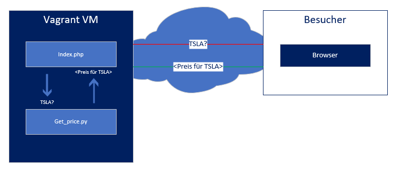
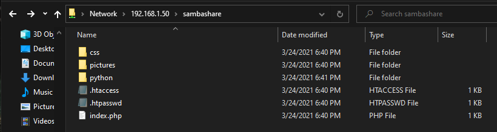
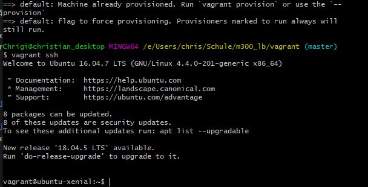
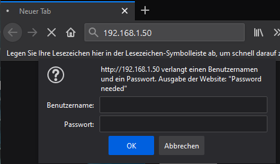
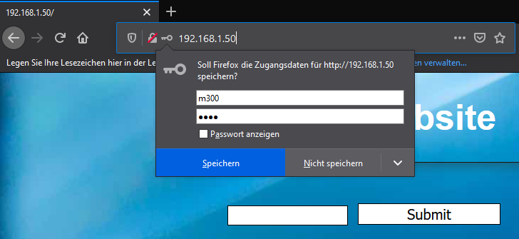
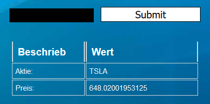

# Table of contents

- [Table of contents](#table-of-contents)
- [1. Einleitung](#1-einleitung)
- [2. Webseite](#2-webseite)
  - [2.1 Konzept](#21-konzept)
  - [2.2 Funktionsweise der Webseite](#22-funktionsweise-der-webseite)
  - [2.3 Funktionsweise "get_price.py"](#23-funktionsweise-get_pricepy)
- [3. Zusätzlicher Dienst - Samba Share](#3-zusätzlicher-dienst---samba-share)
- [4. Sicherheit](#4-sicherheit)
  - [4.1 Funktionsweise von htaccess](#41-funktionsweise-von-htaccess)
  - [4.2 Aufbau von htaccess](#42-aufbau-von-htaccess)
  - [4.3 Firewall](#43-firewall)
- [5. Testing](#5-testing)
  - [Testfall 1](#testfall-1)
  - [Testfall 2](#testfall-2)
  - [Testfall 3](#testfall-3)
  - [Testfall 4](#testfall-4)
  - [Testfall 5](#testfall-5)
  - [Testfall 6 - Samba](#testfall-6---samba)
  - [Testfall 7 - Samba](#testfall-7---samba)
- [Quellen](#quellen)

    
# 1. Einleitung

In der LB2 werden wir eine Webseite erstellen, welche anhand eines Aktien kürzels den Preis der aktie rausfinden kann.
Ziel ist die Website selbst zu erstellen, Sie automatisch auf der Vagrant vm laufen zu lassen und die Seite Passwort zu schützen.  
Verwenden werde ich neben PHP auch Python, was die Preise der Aktie für mich rausfindet. Die IP werde ich statisch setzen. 
    

# 2. Webseite

 

___
## 2.1 Konzept

 

Die Website soll eine PHP-Webseite sein, welche eine Python Datei zum rausfinden von Aktien preisen benutzt. 

Hier visualisiert:
 
*Der Zugriff übers Internet funktioniert leider nicht*
 
 
Auf der Browser Seite sieht es für den User ungefähr folgendermassen aus:
 
___
## 2.2 Funktionsweise der Webseite

 

Auf der Webseite haben wir ein kleines Fenster zum Eingeben des Valors erstellt welches mit einem Submit button abgeschickt werden kann.

    <form action="" method="Post">
        <label for="stock">Stock:</label> 
        <input type="text" id="stockin" name="stock" value="" > 
        <input type="submit" id="stocksub" name="submit" value="Submit">
    </form>

Um die Daten auszulesen wird anschliessend PHP verwendet, was in der Praxis etwa so aussieht:

    <?php
        $valor = $_POST['stock'];
        $price = exec("python3.6 ./python/get_price.py $valor 2<&1");
        $valor_py = file_get_contents( "./python/tmp/stock" );
        $price_py = file_get_contents( "./python/tmp/price" );
        echo $valor_py;
        echo $price_py;
    ?>

Dabei ist $valor der eingegebene Wert, welcher weiter unten verwendet wird um mithilfe von Pyhton den Preis rauszufinden. An unterster Stelle werden sowohl der Preis als auch der Valor ausgegeben welche aus den von Python erstellten Files ausgelesen werden kann. 

 

___ 
## 2.3 Funktionsweise "get_price.py" 
 

Die "get_price.py" datei ist eine Python Datei, welche den Preis des Valors mithilfe einer API rausfindet. Anschliessend wird sowohl der Valor als auch der Preis in zwei seperate Files geschrieben. Diese werden dann wie oben vom PHP auf der Webseite angezeigt. 

Hier eine kleine übersicht zu den Dateien:

| Filename | Description        | Path                      | Content  |
|----------|--------------------|---------------------------|----------|
| stock    | Name of the stock  | /website/python/tmp/stock | ``tsla``     |
| price    | Price of the stock | /website/python/tmp/price | ``658.(..)`` |

 
Die Python Datei sieht folgendermassen aus:

 

    #1 import sys
    #2 from yahoo_fin import stock_info as si
    #3
    #4 stock = str(sys.argv[1])
    #5
    #6 price = si.get_live_price(stock)
    #7 price_str = str(price)
    #8 file_price = "/var/www/html/python/tmp/price"
    #9 file_stock = "/var/www/html/python/tmp/stock"
    #10
    #11 with open(file_price, 'w') as fileowrite:
    #12        fileowrite.write(price_str+" ")
    #13
    #14 with open(file_stock, 'w') as fileowrite:
    #15        fileowrite.write(stock+" ")

-   Im oberen Teil werden alle benötigten Module installiert welche benötigt werden. "sys" benutze ich im script, um Argumente vom PHP entgegen zu nehmen (#4). 
-   Das zweite Modul in der Zeile #2 wird dazu benötigt die aktuellen Preise der Aktien zu bekommen. 
-   Anschliessend wird in der Zeile #6 der preis rausgefunden in dem Man die API mit dem Stock Namen "füttert"
-   Unten werden beide Daten (Stock und Preis) in die beiden Files geschrieben, aus dem unser PHP die Daten enziehen kann. 
    

___
# 3. Zusätzlicher Dienst - Samba Share

**Al**s zusätzlichen Dienst habe ich eine Samba Freigabe erstellt, welche den gesamten /var/www/html Ordner freigibt. Installiert habe ich diesen Service, damit man jederzeit die Webseite anpassen kann, ohne sich auf die Maschine verbinden zu müssen.  
Erstellt wird der Samba Share durch einen Konfigurationsbereich in der smb.conf Datei. 

    [sambashare]
    comment = Samba on Ubuntu
    path = /var/www/html
    read only = no
    browsable = yes
Um den User zu erstellen musste eine Bash Datei erstellt werden, da man dass Password leider nicht uninteraktiv festlegen konnte. 

    #!/bin/bash
    pass=root
    if [ -z "$SUDO_USER" ]; then
        echo "This script is only allowed to run from sudo";
        exit -1;
    fi
    (echo "$pass"; echo "$pass") | smbpasswd -s -a vagrant

Zwar könnte man die unterscheidung zwischen Sudo User und normalem user weglassen, persönlich finde ich dass allerdings eleganter. 

Mit dem Share kann man neben der Webseite andere configurations Dateien mit Visual Studio Code anschauen um einen besseren überblick zu bekommen. Unter Windows muss man sich dort nur per erstellten User anmelden und kann die Dateien einsehen:

 
 
 
___
# 4. Sicherheit
Auch für die Sicherheit habe ich mir Gedanken gemacht und bin zum Schluss gekommen, dass ich .htaccess verwenden werde, da dies eine leichte art der Authentifizierung ist, welche für eine Webseite dieser Art vollkommen ausreicht. 
 
 
___
## 4.1 Funktionsweise von htaccess

htaccess ist eine Konfigurationsdatei welche Verzeichnisbezogene Regeln erstellt. ich persönlich brauche sie allerdings nur, um das Passwort abzufrage. 
 
 
___
## 4.2 Aufbau von htaccess

    AuthType Basic
    AuthName "Password needed"
    AuthUserFile /var/www/html/.htpasswd
    Require valid-user

Hier gebt man zum einen an, was der Grund für das Passwort ist (Authname "Password needed") und zum anderen den zugehörigen Pfad zum password File, welchen man sich im Internet generieren lassen kann.  
So sieht das htpasswd aus:
    
    m300:$apr1$2siq4wkt$25P6wMyMim6N08yLmmKqV0

Ganz vorne zu erkennen ist der Username und im zweiten Teil ist das verschlüsselte Passwort, welches in diesem Fall ebenfalls m300 ist. 
 
 
___
## 4.3 Firewall

Für die Firewall habe ich nur die vier Regeln erlaubt, welche für Samba und fürs Apache benötigt werden, dies sieht etwa so aus:

    Status: active

    To                         Action      From
    --                         ------      ----
    Samba                      ALLOW       Anywhere
    Apache                     ALLOW       Anywhere
    22                         ALLOW       Anywhere
    Samba (v6)                 ALLOW       Anywhere (v6)
    Apache (v6)                ALLOW       Anywhere (v6)
    22 (v6)                    ALLOW       Anywhere (v6)

 
 

___
# 5. Testing

## Testfall 1
Die Virtuelle Maschine Setzt sich ohne Userinteraktion selber auf.   
  

## Testfall 2
Die VM ist Pingbar

>C:\Users\chris>ping 192.168.1.50  
>Pinging 192.168.1.50 with 32 bytes of data: 
>Reply from 192.168.1.50: bytes=32 time<1ms TTL=64 
>Reply from 192.168.1.50: bytes=32 time<1ms TTL=64 
>Reply from 192.168.1.50: bytes=32 time<1ms TTL=64 
>Reply from 192.168.1.50: bytes=32 time<1ms TTL=64 

## Testfall 3
Die Webseite ist erreichbar 
  

## Testfall 4
Die Webseite wird beim richtigen Password aufgerufen:  
  

## Testfall 5
Preise und Name der Aktie werden wie gewünscht angepasst.   
  

## Testfall 6 - Samba

Es wird ein Password verlangt:

>C:\Users\chris>net use z: \\192.168.1.50\sambashare 
The password is invalid for \\192.168.1.50\sambashare.  
Enter the user name for '192.168.1.50': vagrant 
Enter the password for 192.168.1.50: 
The command completed successfully. 

## Testfall 7 - Samba

Inhalt wird angezeigt:

 
   
___
# Quellen

- [Samba](https://ubuntu.com/tutorials/install-and-configure-samba#1-overview)
- [htaccess theorie](https://de.wikipedia.org/wiki/.htaccess)
- [htpasswd](https://www.redim.de/blog/passwortschutz-mit-htaccess-einrichten)
- [yahoo_fin](https://algotrading101.com/learn/yahoo-finance-api-guide/)
- [python und php](http://www.terragon.de/kuenstliche-intelligenz/python-tutorials/python-in-php-ausfuehren/#:~:text=Schritt%201%3A%20PHP%20Datei%20erstellen&text=Dann%20wird%20das%20Python%20Skript,und%20Dateiname%20des%20Python%20Skriptes.)