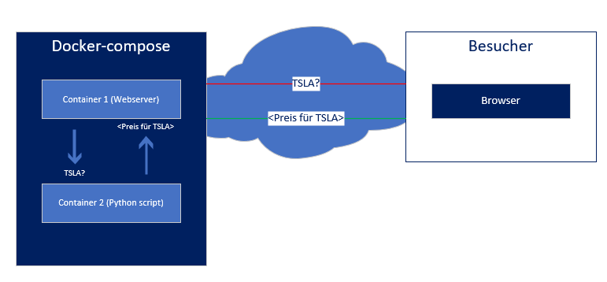
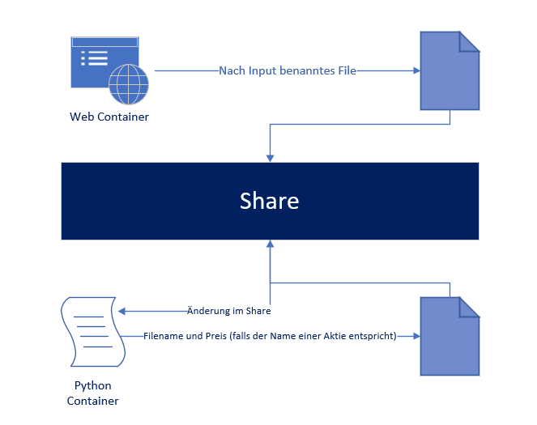

# Table of contents

- [Table of contents](#table-of-contents)
- [1. Einleitung](#1-einleitung)
- [2. Webseite](#2-webseite)
  - [2.1 Konzept](#21-konzept)
  - [2.2 Funktionsweise der Webseite](#22-funktionsweise-der-webseite)
- [3. Python Script](#3-python-script)
  - [2.1 Konzept](#21-konzept-1)

    
# 1. Einleitung

In der LB3 werden wir eine Webseite der LB2 zwar wiederverwenden, jedoch Erweiterungen hinzufügen und die Abfrage des Preises über einen Seperaten Container laufen lassen. 

Dies möchten wir über einen share ermöglichen, in dem die Webseite Daten mit dem Python Script austauschen kann.
    

# 2. Webseite

 

___
## 2.1 Konzept

 

Die Website soll eine PHP-Webseite sein, welche eine Python Datei zum rausfinden von Aktien preisen benutzt. 

Hier visualisiert:
 

 
 
Auf der Browser Seite sieht es für den User ungefähr folgendermassen aus:
 
 

___
## 2.2 Funktionsweise der Webseite

 

Auf der Webseite haben wir ein kleines Fenster zum Eingeben des Valors erstellt welches mit einem Submit button abgeschickt werden kann.

    <?php
    if (isset($_POST['stock']))
    {
      $valor = $_POST['stock'];
    } 
    else{
      $valor = "Nothing";
    }
    if (preg_match("/[A-Z]/i",$valor)) {
      $myfile = fopen("./python/tmp/$valor", "w") or die("Unable to open file!"); #File erstellen
      fclose($myfile);
      sleep(1);
      $valor_py = file_get_contents( "./python/tmp/stock.txt" ); #Aktien Namen auslesen
      $price_py = file_get_contents( "./python/tmp/price.txt" ); #Preis auslesen
    } else {
      $valor_py = "Not Set"; #Falls nichts eingegeben Not Set
      $price_py = "Not Set";
    }
    ?>

Hier mussten wir gleich mehrere Sachen abänder, weil sich der "Python Container" nicht über einen einfachen Befehl aufrufen lies. 
Um in durchgehend laufen zu lassen hat er also in einem Ordner nach änderungen gesucht.

Mit unserer Webseite mussten wir so nur noch die richtigen Berrechtigungen haben um ein file im Share zu generieren und dieses anschliessend mit dem Namen der Aktie umbenennen. 

 

# 3. Python Script

 

___
## 2.1 Konzept

 

 

1) Nach dem input auf der Webseite erstellt die Webseite ein File mit dem Namen vom Input (z.B. TSLA)
2) Der Python Container, welcher durchgehend nach Änderungen auf dem Share sucht, merkt das und findet den Namen der Aktie durch den Filenamen raus. 
3) Mit dem Namen versucht er mithilfe von yahoo_fin den Preis für diese Aktie rauszufinden.
4) Falls dies geglückt ist und die Aktie existiert, schreibt er Preis und Namen seperat in zwei Files.
5) Die Webseite zeigt die Inhalte der Files genau eine Sekunde nach dem erstellen vom File an.
6) Das File wird vom Script gelöscht damit der Ordner nicht überfüllt wird. 

